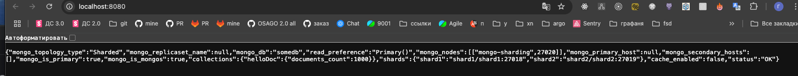

# pymongo-api

## Как запустить

Запускаем mongodb и приложение

```shell
docker compose up -d
```


Делаем инициализацию mongodb 

```shell
bash ./scripts/mongo-init.sh
```

После выполнения скрипта вы должны увидеть 

```shell
MongoNetworkError: connect ECONNREFUSED 127.0.0.1:27018
MongoNetworkError: connect ECONNREFUSED 127.0.0.1:27019
MongoNetworkError: connect ECONNREFUSED 127.0.0.1:27020

```

Заполняем mongodb данными

```shell
bash ./scripts/mongo-fill-data.sh
```

После выполнения скрипта вы должны увидеть

```shell
1. Добавляем шарды и настраиваем шардинг...
Всего документов в кластере: 1000
2. Проверяем количество документов на шарде 1...
Документов на shard1: 492
3. Проверяем количество документов на шарде 2...
Документов на shard2: 508
Инициализация завершена!
```

## Как проверить

### Если вы запускаете проект на локальной машине

Откройте в браузере http://localhost:8080

Должны увидеть


### Если вы запускаете проект на предоставленной виртуальной машине

Узнать белый ip виртуальной машины

```shell
curl --silent http://ifconfig.me
```

Откройте в браузере http://<ip виртуальной машины>:8080

## Доступные эндпоинты

Список доступных эндпоинтов, swagger http://<ip виртуальной машины>:8080/docs
