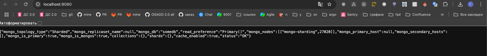

# pymongo-api

## Как запустить

Запускаем mongodb и приложение

```shell
docker compose up -d
```


Делаем инициализацию mongodb 

```shell
bash ./scripts/mongo-init.sh
```

Заполняем mongodb данными

```shell
bash ./scripts/mongo-fill-data.sh
```

После выполнения скрипта вы должны увидеть

```shell
1. Инициализируем конфигурационный сервер (replica set)...
MongoServerError: already initialized
2. Инициализируем шард1 (replica set)...
MongoServerError: already initialized
3. Инициализируем шард2 (replica set)...
MongoServerError: already initialized
4. Ждем стабилизации репликационных наборов...
5. Добавляем шарды в кластер через mongos...
Всего документов в кластере: 1000
6. Проверяем количество документов на репликах шарда 1...
Документов на shard1 primary: 492
Документов на shard1 secondary: 492
7. Проверяем количество документов на репликах шарда 2...
Документов на shard2 primary: 508
Документов на shard2 secondary: 508

```

Инициализируем redis

```shell
bash ./scripts/redis-init.sh
```
После выполнения скрипта вы должны увидеть

```shell
[OK] All nodes agree about slots configuration.
>>> Check for open slots...
>>> Check slots coverage...
[OK] All 16384 slots covered.
```

## Как проверить

### Если вы запускаете проект на локальной машине

Откройте в браузере http://localhost:8080

Должны увидеть


### Если вы запускаете проект на предоставленной виртуальной машине

Узнать белый ip виртуальной машины

```shell
curl --silent http://ifconfig.me
```

Откройте в браузере http://<ip виртуальной машины>:8080

## Доступные эндпоинты

Список доступных эндпоинтов, swagger http://<ip виртуальной машины>:8080/docs
